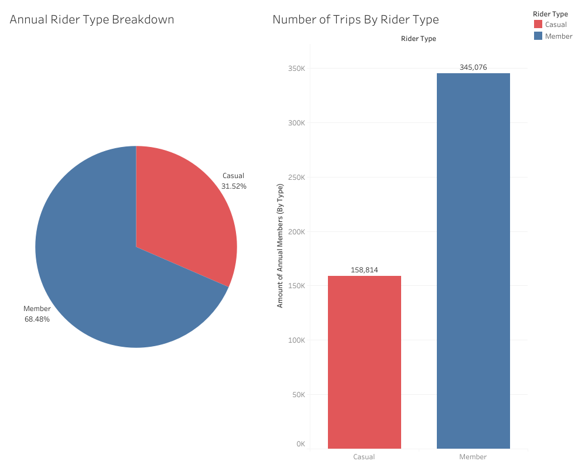
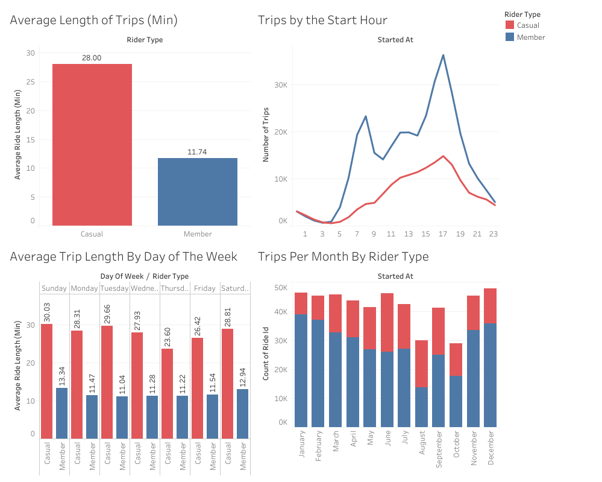
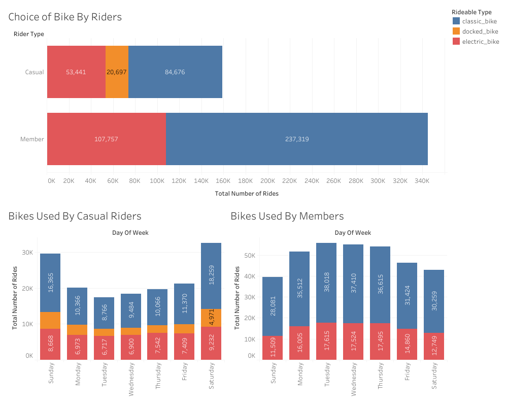
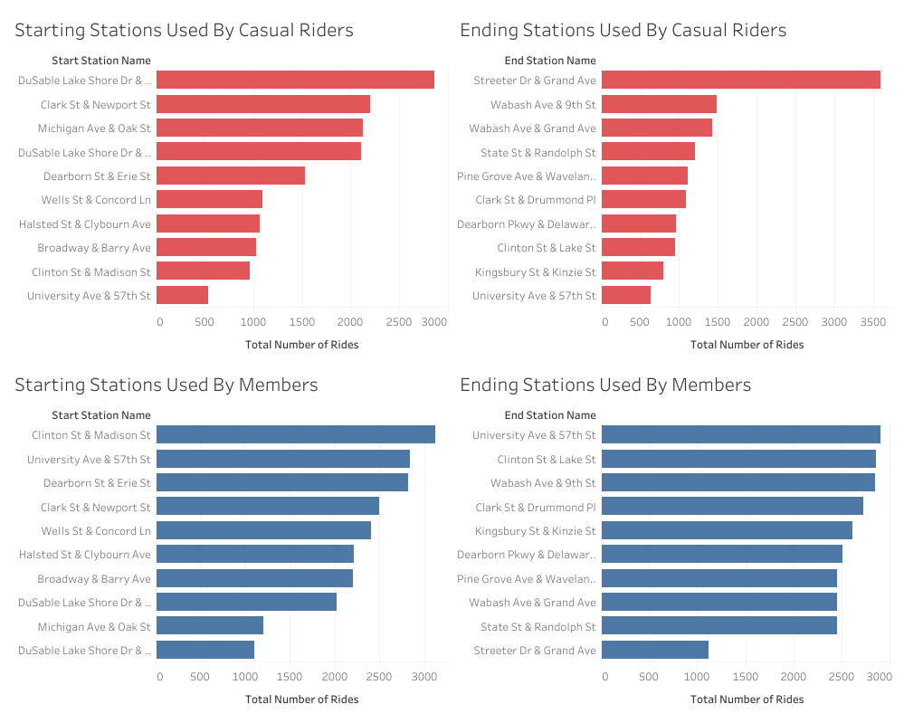
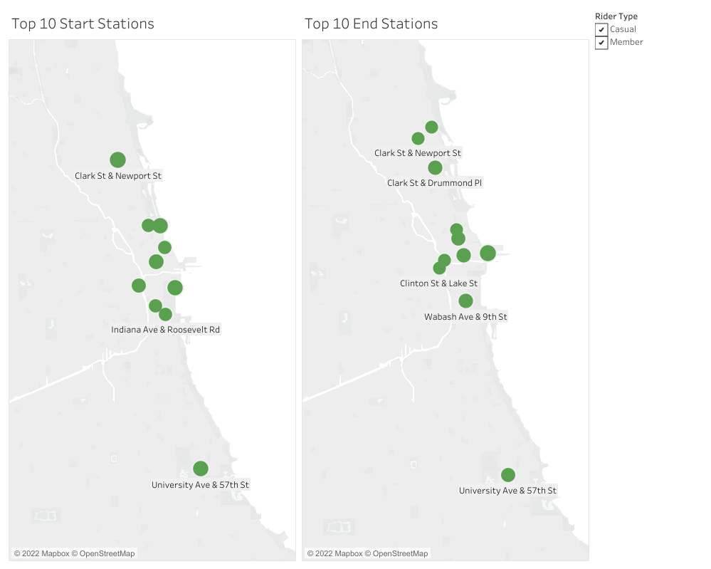

# Google Data Analytics Certificate: Capstone Project
## Cyclist Ride Share Analysis


### INTRODUCTION
This case study project takes a deeper dive through a large, public data set to recreate real-world scenarios in which data analysts clean and organize data to contribute to business decisions and growth. Throughout this project, I will be analyzing historical data from a fictional bike sharing company, "Cyclistic", to assist in making recommendations for an upcoming marketing camapign. Although Cyclistic and the given scenarios are fabricated, this capstone project does involve real data that has been collected from August 2021 - July 2022 through a bike share program located in Chicago. I will be using the Google Big Query SQL* IDE for data cleaning and analysis followed by Tableau for data visualization.
> *The original CSV files exceeded the upload memory limit on Big Query. Each CSV files of ~800,000 records were truncated to 50,000 records each. Although this project will not include all the given data provided, enough information remains to allow for statistically accurate analysis.

### SCENARIO
Cyclistic is a fictional bike sharing company located in Chicago. It operates a fleet of more than 5,800 bicycles which can be accessed from over 600 docking stations across the city. Bikes can be borrowed from one docking station, ridden, then returned to any docking station in the system Over the years marketing campaigns have been broad and targeted a cross-section of potential users. Data analysis has shown that riders with an annual membership are more profitable than casual riders. The marketing teams are interested in creating a campaign to encourage casual riders to convert to members.

The company’s future success depends on maximizing the number of annual memberships and needs to understand how casual riders and annual members use Cyclistic bikes differently. From these insights,your team will design a new marketing strategy to convert casual riders into annual members. But first, Cyclistic executives must approve your recommendations, so they must be backed up with compelling data insights and professional data visualizations.

### BUSINESS TASK
- How do annual members and casual riders use Cyclistic bikes differently?
- Why would casual riders buy Cyclistic annual memberships?
- How can Cyclistic use digital media to influence casual riders to become members?

### DATA PREPARATION
#### DATA SOURCE AND CREDIBILITY?
The [databases](https://divvy-tripdata.s3.amazonaws.com/index.html) that were used for the purpose of the ride share analysis were obtained by Motivate, a company that is employed by the City of Chicago to collect data on the bike share operation throughout the city. 

#### DATA ORGANIZATION
The data was downloaded as separate CSV files, that were then joined together using SQL to make a new, combined annual database of the previous years worth  of bicycle usage data. The original files contained 13 columns with important information which include ride ID, ride time, start/end locations, etc.

NOTE: The original 12 (monthly) CSV file sizes were too large to be imported, so all 12 files were truncated to have 50,000 rows each, a sufficient amount of data to still make an accurate analysis with

```sql
CREATE TABLE `capstone-362223.Capstone_Project.Annual_Cycling` AS

  (SELECT *
  FROM `capstone-362223.Capstone_Project.July_2022` AS July_2022
  UNION ALL

  SELECT *
  FROM `capstone-362223.Capstone_Project.June_2022` AS June_2022
  UNION ALL

  SELECT *
  FROM `capstone-362223.Capstone_Project.May_2022` AS May_2022
  UNION ALL

  SELECT *
  FROM `capstone-362223.Capstone_Project.April_2022` AS April_2022
  UNION ALL

  SELECT *
  FROM `capstone-362223.Capstone_Project.March_2022` AS March_2022
  UNION ALL

  SELECT *
  FROM `capstone-362223.Capstone_Project.February_2022` AS February_2022
  UNION ALL

  SELECT *
  FROM `capstone-362223.Capstone_Project.January_2022` AS January_2022
  UNION ALL

  SELECT *
  FROM `capstone-362223.Capstone_Project.December_2021` AS December_2021
  UNION ALL

  SELECT *
  FROM `capstone-362223.Capstone_Project.November_2021` AS November_2021
  UNION ALL

  SELECT *
  FROM `capstone-362223.Capstone_Project.October_2021` AS October_2021
  UNION ALL

  SELECT *
  FROM `capstone-362223.Capstone_Project.September_2021` AS September_2021
  UNION ALL

  SELECT *
  FROM `capstone-362223.Capstone_Project.August_2021` AS August_2021
  );
```
> Creating one joined table of all 12 monthly data tables 

### PROCESS AND CLEANING
#### REVIEW OF DATA        
As stated before, the data was processed, cleaned, and analyzed using SQL. 

<<<<<<< Updated upstream
```sql
=======
```
>>>>>>> Stashed changes
SELECT COUNT (1) AS total_rows
FROM `capstone-362223.Capstone_Project.Annual_Cycling`
```

> Confirming total number of records in the conjoined table


- Ride Length
- Day of the Week

<<<<<<< Updated upstream
```sql
=======
```
>>>>>>> Stashed changes
create view `capstone-362223.Capstone_Project.View_Cycling` as 
SELECT *, TIMESTAMP_DIFF(ended_at, started_at, minute) AS ride_length, extract(dayofweek from ended_at) as day_of_week
FROM `capstone-362223.Capstone_Project.Annual_Cycling`

```
> Ride length was used finding the difference between the time the ride ended with the time the ride started. Day of the week was extracted from the timestamp data from the 'ended_at' column.

#### DATA CLEANING
The process in data cleaning was to make sure that the data table did not include any anomolies that would potentially skew the results of the findings. Data cleaning is a vital step in the data analysis process as data in error could lead to incorrect findings which has the potential to lead to business decisions that do not accurately tackle the issues as they are in reality.

The next steps below are taken to confirm that the data set does not have any potential anomolies:

```
Select min (end_lng), max(end_lng), min (end_lat), max(end_lat), min (start_lng), max(start_lng), min (start_lat), max(start_lat)
from `capstone-362223.Capstone_Project.View_Cycling`
```
> Minimum/maximum values of various columns tested to make sure they comply within the boindaries of their respective category values

```
select rideable_type, count(1)
from `capstone-362223.Capstone_Project.View_Cycling`
group by rideable_type
```
> Confirming ride types only show electric, classic, and docked bikes

```
select ride_id, count(1)
from `capstone-362223.Capstone_Project.View_Cycling`
group by ride_id
having count(1)>1
```
> Checking there are no duplicate ride ID as they are unique for each ride taken

<<<<<<< Updated upstream
```sql
=======
```
>>>>>>> Stashed changes
select *
from `capstone-362223.Capstone_Project.View_Cycling`
where started_at IS NULL and ended_at IS NULL
```
> Checking to make sure no errors occured with the ride such that the time the ride started and/or ended was not recorded and was left as an empty NULL

Fortunately, the combined data table did not show any anomolies from the initial review. This may be in part that the data table is only showing a percentage of the original data (due to file size restraints). The only problem that occured while sifting through the table was that a lot of records showed NULL values for start/end stations. Without this information a lot of key information is left out for our analysis and thus must be removed as to not skew the results

<<<<<<< Updated upstream
```sql
=======
```
>>>>>>> Stashed changes
create table capstone-362223.Capstone_Project.Final_Cycling as 
SELECT *
FROM capstone-362223.Capstone_Project.View_Cycling
WHERE (case when started_at >= ended_at then 1
      when ride_length IS NULL OR ride_length <= 0 then 1
      when start_station_name IS NULL OR end_station_name IS NULL then 1
      else 0 end) <> 1
```
> Final draft of table which excludes all potential anomolies such as: a ride length of 0 or less, start time later than end time, start/end stations with NULL values.

### SUMMARY OF ANALYSIS

A magnitude of insights were discovered using this final table for analyzing the bicycle data and diffiernetiating the activity differences between members with casual riders. Rather than demonstrate in code, this table was imported into Tableau, to show in a visual format what this data tells us about the bike service and what business strategies that can be implemented to expand the company growth and service.

For further information through the interactive Tablbeau dashboard, [click here](https://public.tableau.com/views/BikeShareDashboard_16648473318720/MemberBreakdown?:language=en-US&:display_count=n&:origin=viz_share_link).

##### MEMBER BREAKDOWN


> Member riders appear to take more trips throughout the city within the past year, as casual riders only appear to be just short of 1/3 of the total rides

##### TRIP DURATIONS AND TIMES


> - Interestingly, although members make up for most of the rides in Chicago, casual members are using the bikes for a far longer duration. Casual riders average at about 28 minutes a ride while members average at about 12 min per ride, a 58% difference in time. 
> 	- This trip duration difference could be a result in how riders view their bike usage based off their membership status. Member's who pay for their subscription have the flexibility to lock in lower rates and therefore use the bikes more casually and for quicker trips. Casual members, however, pay more for their usage per trip they take so it's possible that casual riders on average will take trips when needed for longer ride durations rather than pay for short distance trips.
> - The number of trips that start throughout the day appear to follow a closely parallel trend between casual riders and members. Although member riders appear to have some dips throughout the day at when their rides start, the number of riders increases over the day between them and casual riders, appearing to reach peak rider count at 5 P.M. before gradually lowering. 
> 	- Member riders appear to show 2 additional peaks indpependent from 5 P.M., one at 8 A.M and the other at noon (lunch-time). One possibility for this occurance could be that members will use the bikes which correspond to a typical work-day schedule.
> - Throghout the week, the data appears to show no particular day with a higher or lower count in trip time duration. Members and casual riders display a consistent trip length throughout the week, with Thursdays appearing to be slightly lower for casual members at 23.6 min, second to Friday's at 26.42 min which is the greatest difference in time between the days of the week. This is interesting to see as one would believe that weekend days would possibly show longer rides.
> - Monthly breakdown of ridership shows that there is a steady and constant amount of riders (40-50K) throughout the year besides August and October, which show only about 30,000 rides. Further analysis on this would be required as to why these months are showing lower ridership.
> 	- The seasons do not appear to influence the status of rider usage. Winter months would normally average less riders whereas Summer months would have the highest of the year, however, the data proves that in this case it is not true.

#### RIDE TYPE BREAKDOWN


> - Between both member types, the classic, non-electrical bikes were favored far greater. The data shows that the non-electrical bikes were used pver 50% of the time. Breaking this down further by member type and day of the week it is clear that each day shows favor for the classic bikes, significantly more for members than casual riders.

#### TOP STARTING AND ENDING STATIONS



> - Members and casual riders share some similarities but also differences in their most popular starting stations and ending stations. Top starting and destination stations for casual riders appear to cluster around tourist-areas centered around Lincoln Park and the Field Museum. Member riders top starting stations appear to be a bit more spread out and involve more office-space based locations.

### BUSINESS SUGGESTIONS

In order to expand company business and growth, the following recommendations can be made to the Cyclistic stakeholders:

* Increase marketing campaigns and advertisements at the top start and end stations for casual riders, which appear to be in tourist areas and attractions. 
* As it appears that no particular day of the week nor month show more rider usage, marketing should be targeted towards the busiest time of the day for casual riders which is on average 5 P.M. If August and October can be researched more as to why there is on average 10,000 less riders during those months then marketing strategies can shift focus to try and attain more riders during these lower usage months.
* Further data should be explored to determine riders who are local to the Chicago area whith a casual membership. Tourists are less likely to convert to membership types if they are only temporarily staying thus focus should be on targeting indivuals who live in the city.
* Offer discounts to members who are able to convince casual riders to switch over to member status as this will not only help encourage more riders to join the program but also create a sense of community.
<<<<<<< Updated upstream
=======


>>>>>>> Stashed changes
